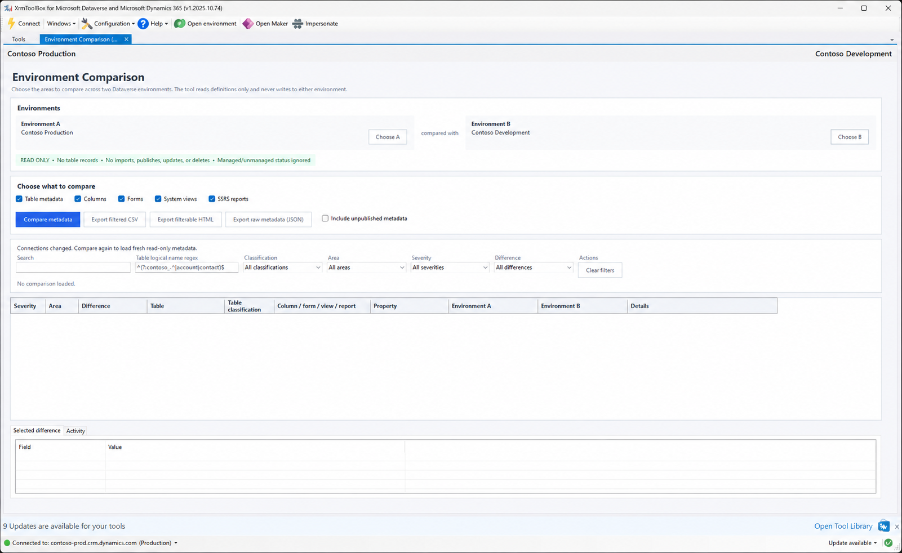

# Environment Comparison for XrmToolBox

Environment Comparison is a read-only XrmToolBox plugin for finding meaningful Dataverse definition differences between two environments.

Use it before or after a deployment to answer questions such as:

- Is a table or column missing from the target environment?
- Did an important column setting change?
- Are the deployed forms and system views materially different?
- Does an organization SSRS report have different settings or RDL?


> Documentation screenshots use fictional Contoso connections and metadata. No customer environment data is included.

## Highlights

- Compares table metadata, columns, system forms, system views, and organization SSRS reports.
- Treats Environment A as the reference and Environment B as the target.
- Reads definitions only; it does not read business table rows or make Dataverse changes.
- Ignores managed-versus-unmanaged state, solution layers, component versions, and other deployment noise.
- Normalizes XML to suppress formatting-only differences.
- Supports search, table logical-name regex, table classification, area, severity, and difference filters.
- Exports filtered CSV, a standalone filterable HTML report, and diagnostic raw metadata JSON.
- Keeps the result grid responsive by previewing large definitions with fingerprints rather than rendering complete XML.

## Comparison areas

| Area | What it checks |
| --- | --- |
| Table metadata | Presence, classification, names, ownership, primary columns, auditing, change tracking, and important table capabilities |
| Columns | Presence, possible rename/recreation hints, types, requirement level, security/audit flags, lengths, ranges, formats, choices, lookups, formulas, file/image settings, and more |
| Forms | Presence, type, state, presentation, security role assignments, and normalized Form XML |
| System views | Presence, query/default/quick-find settings, FetchXML, Layout XML, and column-set XML |
| SSRS reports | Presence, identity, settings, filters, related tables, categories, visibility, and normalized RDL |

See [Choosing comparison areas](docs/comparison-areas.md) for the exact property lists and matching rules.

## Quick start

1. Open Environment Comparison in XrmToolBox.
2. Select a saved connection for **Environment A** and another for **Environment B**.
3. Select one or more comparison areas.
4. Leave **Include unpublished metadata** off for the normal deployed-state comparison.
5. Select **Compare metadata**.
6. Review Critical and High differences first, then filter or export the result.



Environment A is the source or expected state. Environment B is the target being validated. For example, **Missing in B** means the component exists in the reference environment but not in the target.

The table logical-name regex is applied after retrieval. It scopes table-associated preview and exports without changing what Dataverse metadata is queried. Reports and other organization-level rows are retained.

For a complete walkthrough, see [Getting started](docs/getting-started.md).

## Exports

- **Export filtered CSV** exports exactly the rows visible under the current plugin filters. Long values are split into numbered Excel-safe columns when required.
- **Export filterable HTML** exports every difference in the active table regex scope. The standalone report provides independent filters, pagination, resizable columns, full-value inspection, and enhanced diffs.
- **Export raw metadata (JSON)** exports structured diagnostic snapshots from both environments. It is intended for investigation and contains complete definitions, not only differences.

See [Exporting results](docs/exporting-results.md) for format selection, filtering behavior, and large-value handling.

## Read-only contract

All Dataverse operations are reads. The plugin has no create, update, delete, associate, disassociate, import, export-solution, publish, or other Dataverse write path.

It reads:

- table and column metadata;
- `systemform` definitions and form role assignments;
- `savedquery` system-view definitions;
- organization `report`, `reportentity`, `reportcategory`, and `reportvisibility` records.

It does not read business table records, personal views, personal reports, or reports that exist only in an external SSRS catalog.

Exports are written only to the local file selected by the operator. See [Safety and data handling](docs/safety-and-data-handling.md).

## Documentation

- [User guide](docs/README.md)
- [Getting started](docs/getting-started.md)
- [Choosing comparison areas](docs/comparison-areas.md)
- [Interpreting results](docs/interpreting-results.md)
- [Exporting results](docs/exporting-results.md)
- [Troubleshooting](docs/troubleshooting.md)
- [Safety and data handling](docs/safety-and-data-handling.md)
- [Roadmap](ROADMAP.md)
- [Suggesting a feature](docs/feature-suggestions.md)
- [Contributing and submitting pull requests](CONTRIBUTING.md)
- [Extending the comparison engine](docs/extending.md)

## Build and test

Prerequisites:

- Windows
- .NET Framework 4.8 Developer Pack
- A current .NET SDK or Visual Studio with MSBuild

Run the repository build script:

```powershell
.\scripts\Build.ps1
```

Or run the individual commands:

```powershell
dotnet restore EnvironmentComparison.sln
dotnet test EnvironmentComparison.sln -c Release
dotnet build src\EnvironmentComparison\EnvironmentComparison.csproj -c Release
```

The release build creates:

- `artifacts/EnvironmentComparison.XrmToolBox.1.0.0.8.nupkg`
- `src/EnvironmentComparison/bin/Release/net48/EnvironmentComparison.dll`

All automated tests use synthetic objects or a recording `IOrganizationService`. They do not authenticate to or contact Dataverse.

For local XrmToolBox development, close XrmToolBox and run:

```powershell
.\scripts\Build-And-Install.ps1 -XrmToolBoxPath C:\path\to\XrmToolBox
```

## Packaging

The NuGet package places the plugin DLL under `lib/net48/Plugins`, includes dedicated 80px and 32px images, keeps assembly and package versions aligned, and follows the XrmToolBox validation checklist used by the companion Team Security Role Mapper project.

## License

MIT. See [LICENSE](LICENSE).
