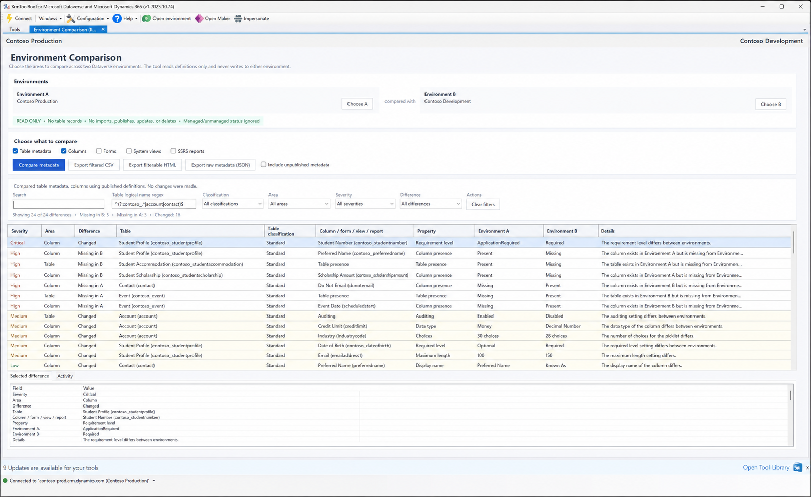

# Environment Comparison user guide

Environment Comparison shows which important Dataverse definitions are missing or materially different between two environments.

> All screenshots in this guide use fictional Contoso connections and metadata.

## Five-minute workflow

1. Select the saved XrmToolBox connection that represents the expected state as **Environment A**.
2. Select the environment being validated as **Environment B**.
3. Check only the areas needed for this investigation.
4. Compare published metadata unless draft customizations are intentionally in scope.
5. Review Critical and High rows, apply filters, and export the useful result set.

**Missing in B** is normally the most important deployment direction: the definition exists in the reference environment but not in the target. **Missing in A** identifies additional definitions found only in the target. **Changed** means both sides were matched and an important property differs.

## Guide map

| Guide | Use it for |
| --- | --- |
| [Getting started](getting-started.md) | Connections, area selection, published state, regex scope, running a comparison |
| [Choosing comparison areas](comparison-areas.md) | Exact properties, exclusions, component identity, and XML normalization |
| [Interpreting results](interpreting-results.md) | Direction, severity, filters, fingerprints, and false-positive reduction |
| [Exporting results](exporting-results.md) | CSV, HTML, raw JSON, Excel limits, and complete definitions |
| [Troubleshooting](troubleshooting.md) | Empty results, slow retrieval, missing components, and export issues |
| [Safety and data handling](safety-and-data-handling.md) | Read-only behavior, permissions, metadata content, and local exports |
| [Roadmap](../ROADMAP.md) | Planned comparison areas, delivery improvements, and design investigations |
| [Suggesting a feature](feature-suggestions.md) | Information needed for an actionable, safe comparison request |
| [Contributing](../CONTRIBUTING.md) | Local setup, development rules, tests, and pull request submission |
| [Extending the comparison engine](extending.md) | Developer steps for adding a comparison area |

## Supported scope

The plugin compares:

- table metadata;
- column metadata;
- system forms and their role assignments;
- system views;
- organization SSRS reports registered in Dataverse.

It deliberately does not compare:

- business table records;
- personal views or personal reports;
- reports stored only in an external SSRS server catalog;
- solution layers or managed-versus-unmanaged state;
- component version stamps;
- app modules, dashboards, charts, keys, relationships, business rules, or organization settings in the current release.

Every environment operation is read-only. Export actions write only to a local path selected by the operator.
