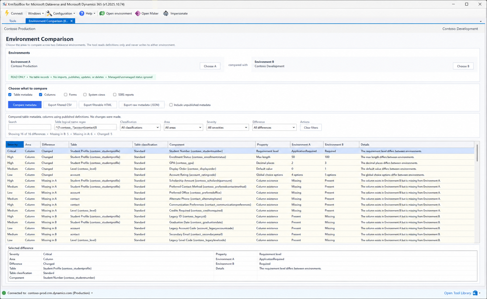

# Getting started

## Before you begin

You need:

- XrmToolBox with Environment Comparison installed;
- two saved Dataverse connections that you are permitted to read;
- metadata read access and read access to the selected system component tables;
- a local folder for any exports you choose to create.

The plugin does not require permission to customize or write to either environment.

## 1. Choose the comparison direction

Open Environment Comparison and select both saved connections.


- **Environment A** is the reference, source, or expected state.
- **Environment B** is the target or environment being validated.

This direction affects both wording and severity. A component present in A but absent from B is reported as **Missing in B** and normally receives a higher severity than an extra component found only in B.

If you reverse the connections, the comparison facts remain valid but the missing direction and priority change.

## 2. Choose what to compare

Select at least one area:

- **Table metadata** for table-level identity and behavior;
- **Columns** for fields and important column settings;
- **Forms** for system form definitions and form security roles;
- **System views** for saved system queries and layouts;
- **SSRS reports** for organization reports registered in Dataverse.

Areas are independent. Selecting fewer areas reduces retrieval time and produces a more focused result. See [Choosing comparison areas](comparison-areas.md) for exact property lists.

## 3. Choose published or unpublished metadata

Leave **Include unpublished metadata** off for normal release verification. This compares the definitions available to users after the latest publish.

Turn it on only when you intentionally need to inspect draft customizations. Unpublished retrieval can take longer, particularly for environments with many forms, views, or reports.

The option remains read-only. It changes the retrieval request, not the environment.

## 4. Set an optional table scope

The **Table logical name regex** starts empty and filters table-associated results after metadata is retrieved when a pattern is entered. It applies to table, column, form, and view rows. It does not remove report or other organization-level rows.

Examples:

```regex
^contoso_
```

Tables whose logical name starts with `contoso_`.

```regex
^(?:contoso_.*|account|contact)$
```

Custom Contoso tables plus Account and Contact.

```regex
^(?!contoso_staging$)contoso_.*$
```

Contoso tables except `contoso_staging`.

Clear the field to include all table logical names. The regex control is disabled when only SSRS reports are selected because report rows have no table logical-name scope.

An invalid expression is shown as a validation message and is not used.

## 5. Run the comparison

Select **Compare metadata**. The activity area reports the current read-only retrieval stage. Keep XrmToolBox open until the comparison completes.

Changing either connection or the selected comparison areas makes the existing result stale. Run the comparison again to load fresh metadata.

## 6. Review the result


Start with:

1. **Critical** rows;
2. **Missing in B** rows;
3. changed column requirements, types, lookup targets, choices, formulas, forms, views, and report RDL;
4. High and Medium rows that affect the deployment's expected behavior.

Select a row to populate **Selected difference** with the full context available in the plugin preview.



Large XML definitions are represented by SHA-256 fingerprints in the grid to keep the plugin responsive. Use CSV, HTML inspection, or raw JSON when the complete definitions are required.

## 7. Filter or export

Combine free-text search with table regex, table classification, area, severity, and difference filters. CSV exports the currently visible set. HTML exports the active table regex scope and provides its own browser filters. Raw JSON exports diagnostic snapshots from both sides.

See [Interpreting results](interpreting-results.md) and [Exporting results](exporting-results.md).

## Tips for large environments

- Start with the area that answers the current question rather than selecting all areas automatically.
- Compare published metadata first.
- Use the table regex to reduce preview and export volume, while remembering that retrieval still reads the selected metadata areas.
- Add forms, views, and reports in separate runs when you need to isolate a slow or noisy area.
- Prefer the HTML report for large results and long XML values.
